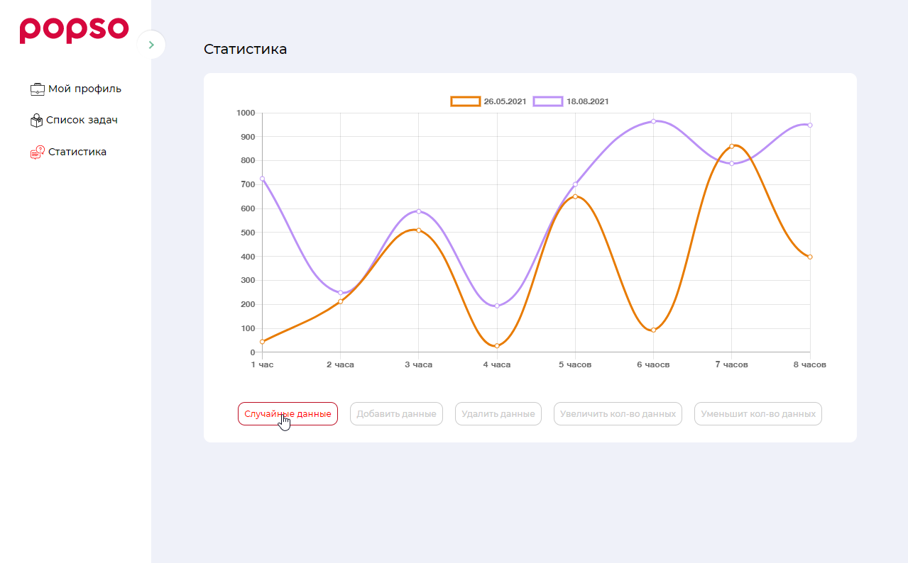

**FULLSTACK NUXT + EXPRESS + MONGODB**

## Build Setup

Для запуска приложение требуется привязать базу mongodb
<p>  https://www.mongodb.com/  </p>
после регистрации на сайте создайте базу данных и привяжите её к приложению указав ссылку вида
<p> ( mongodb+srv://<username>:<password >@cluster0.mwphw.mongodb.net/popso?retryWrites=true&w=majority ) </p>
<p> и вставьте в файле keys.dev.js  </p>
<p>  либо  </p>
<p>  поместитите в специальную переменную env.MONGO_URL  </p>



```bash
# install dependencies
$ yarn install

# serve with hot reload at localhost:3000
$ yarn dev

# build for production and launch server
$ yarn build
$ yarn start

# generate static project
$ yarn generate
```

For detailed explanation on how things work, check out [Nuxt.js docs](https://nuxtjs.org).
